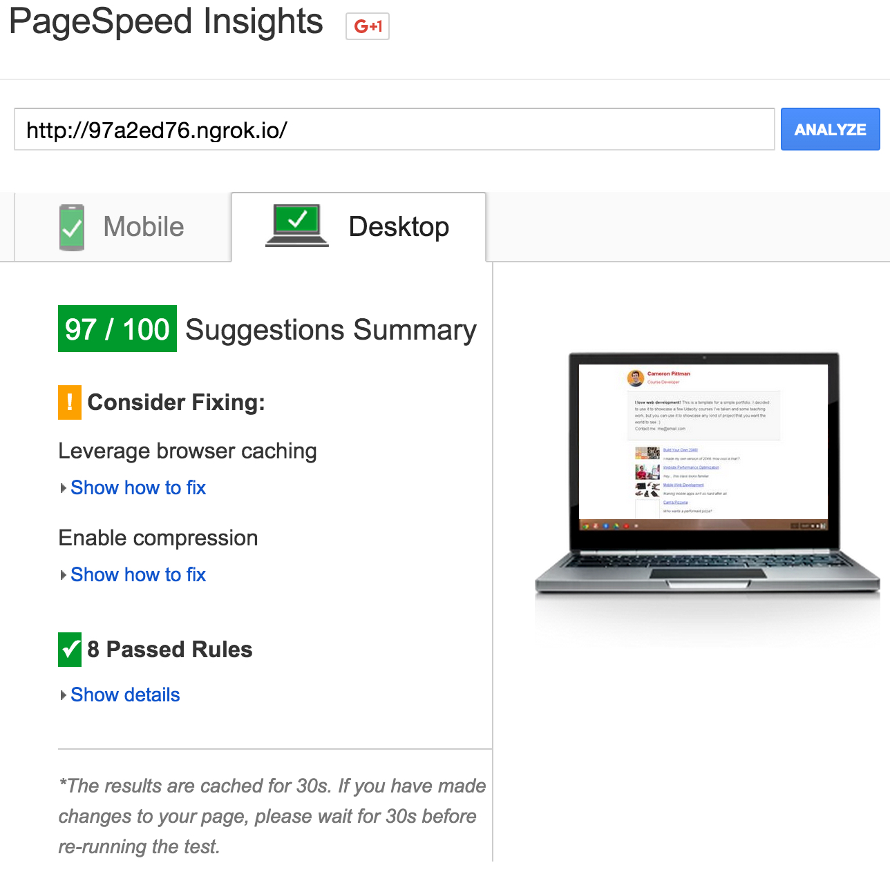
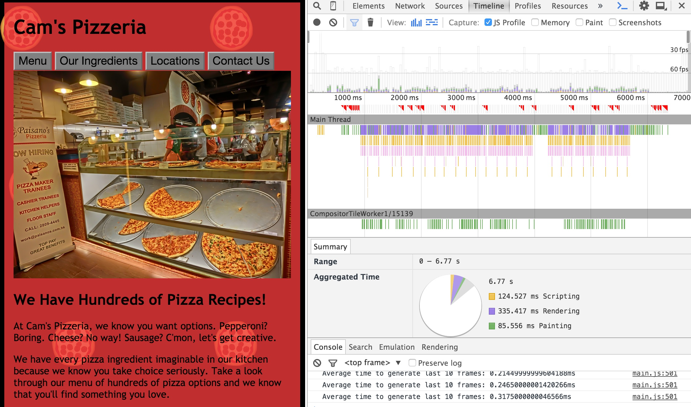
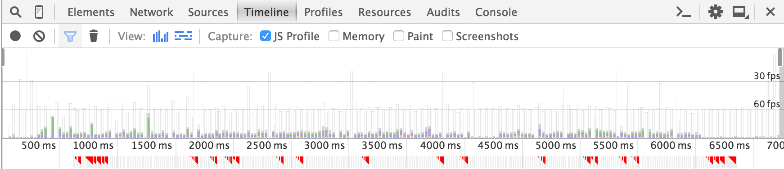

# Web Performance Optimization

By: Yaz Khoury

> This project has been forked from Udacity's Web Optimization Challenge
> At the following link: https://github.com/udacity/frontend-nanodegree-mobile-portfolio

## Part 1

### Overview
Optimizing a given webpage to achieve a Google Pagespeed Insights score of 90 or above.

The following screenshot shows the scores for both mobile and desktop.

Mobile:


As you can see, we have achieved a PSI score of 96. The following screenshow will show the score for desktop.



As you can see, we have achieved a PSI score of 97.

In order to see the page in action, you must generate it. Follow the steps below in order to do so. 
The instructions are for Mac OSX users.

Open your terminal and go to the root of the project. Ensure you have npm and ngrok installed:
```Shell
brew install node
```
After installing node, ensure you have ngrok installed by using the link [here](https://ngrok.com/download).

Once both are installed, run the following command:
```Shell
sudo npm init
```
This will install the node modules into your package json files.

After that, run Gulp to build the tasks for you.
```Shell
gulp
```
This will create the folder called dist, which will have the minified, compressed final site.

Now, do the following:
```Shell
cd dist
```
After that, type the following:
```Shell
python -m SimpleHTTPServer
```

Open a new terminal session and cd to the dist directory in the project again.
Type the following:
```Shell
ngrok http 8000
```

This will create an ngrok tunnel for you. In the output, copy the xxxxx.ngrok.io address generated. 
There are two, pick whichever one you want.
Now, go to the following link for Pagespeed Insights: https://developers.google.com/speed/pagespeed/insights/

Copy paste the link and check out the scores!

### Steps Taken to Optimize

The following steps were taken to achieve this high result:

1.	Inline style.css inside the HTML.
2.	Add async to javascript tags.
3.	Create gulpfile.js to minify CSS, Javascript, and Images.
4.	Compress CSS and Javascript with GZip compression.
5.	Move script tags to the bottom of the page.


## Part 2

### Overview

In this part, we must optimize and transition images to achieve 60fps in pizza.html

To demonstrate the achieved result, observe the following screenshot:



A bigger screenshot of the achieved 60fps is shown here:



The file pizza.html is in the views folder, which is NOT part of the gulpfile.js build.
It is separated to make things simpler. Open pizza.html in your Chrome Browser, open DevTools, and then
click on Timeline, record, and scroll down. You'll get the data afterwards.

### Steps Taken to Optimize

1. On line 548 of main.js, changed pizza number from 200 to 50 since 200 is a lot.
2. On function updatePositions in line 511, moved var scrollnum outside the loop, since the calculation 
	needs to be made once. var items is called once outside the function. We add an if statement to 
	ensure it's called once.
3. On function changepizzaSizes in line 457, made two new variables outside the function cause we just need them
	once, moved var dx outside for loop since it's much cleaner.
4. On line 480, moved var pizzasDiv outside the for loop.

By optimizing the for loops and not having to call variables every time we loop, we make a much smoother transition.


## Bibliography

1. https://github.com/kogakure/gulp-tutorial
2. http://una.im/gulp-local-psi/
3. https://github.com/una/gulp-starter-env
4. https://github.com/fourkitchens/frontend-perf
5. https://github.com/6stringbeliever/frontend-nanodegree-mobile-portfolio
